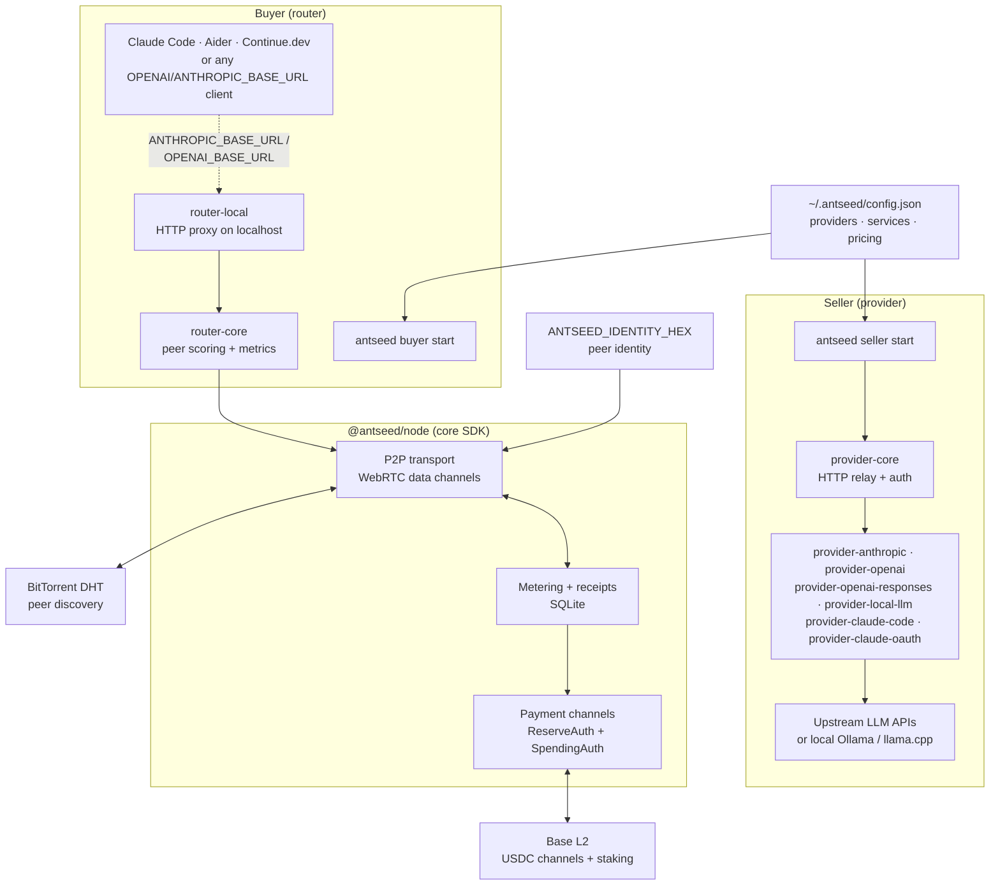

<p align="center">
  
</p>

<h1 align="center">AntSeed</h1>

<p align="center">
  <strong>A PEER-TO-PEER NETWORK FOR DIFFERENTIATED AI SERVICES.</strong>
</p>

<p align="center">
  
  <a href="LICENSE"></a>
  
  
  
</p>

**AntSeed** is a _peer-to-peer AI services network_. Providers offer differentiated AI services — TEE-backed inference, agent skills, fine-tuned models, managed products — and buyers discover providers via DHT, score them on price/latency/reputation, and route requests through encrypted P2P connections.

If you want to monetize an AI service without locking it into a SaaS marketplace, or buy capacity that drop-in replaces `ANTHROPIC_BASE_URL` / `OPENAI_BASE_URL`, this is it.

<p align="center">
  <a href="#quick-start">Getting Started</a> ·
  <a href="#how-it-works">How It Works</a> ·
  <a href="#architecture">Architecture</a> ·
  <a href="#building-a-plugin">Plugin Dev</a> ·
  <a href="docs/protocol/README.md">Protocol Spec</a>
</p>

## Product Preview

<p align="center">
  <video src="brand/product-overview.mp4" width="800" controls muted></video>
</p>

> If the video doesn't render in your viewer, open [`brand/product-overview.mp4`](brand/product-overview.mp4) directly.

## How It Works

**Providers** run a provider plugin that connects to an upstream LLM API (Anthropic, OpenAI-compatible APIs, local Ollama, etc.) and announce capacity on the DHT network.

**Buyers** run a router plugin that discovers providers, scores them on price/latency/reputation, and proxies requests through a local HTTP endpoint that drop-in replaces `ANTHROPIC_BASE_URL` or `OPENAI_BASE_URL`.

**Live pricing:** see [PRICING.md](PRICING.md) or `https://network.antseed.com/stats` (public JSON, no auth).

## Terms of Use

AntSeed is infrastructure for building differentiated AI services — not for raw resale of API keys or subscription access. Providers are expected to add value through domain-specific skills, agent workflows, Trusted Execution Environments (TEEs), fine-tuned models, or other product differentiation. Reselling personal subscription credentials (e.g., Claude Pro/Team plans) violates the upstream provider's terms of service and is not permitted. Always review your API provider's usage policies before offering capacity on the network. Subscription-based provider plugins (e.g., `provider-claude-code`, `provider-claude-oauth`) are provided for local testing and development only.

## Quick Start

Runtime: **Node.js 20+** · Package manager: **[pnpm](https://pnpm.io) 9+**

```bash
# Install dependencies
pnpm install

# Build everything
pnpm run build

# Create config once
node apps/cli/dist/cli/index.js seller setup

# Start providing
node apps/cli/dist/cli/index.js seller start

# Start buying
node apps/cli/dist/cli/index.js buyer start
```

Or install globally:

```bash
npm install -g @antseed/cli
antseed seller setup  # Create ~/.antseed/config.json
antseed seller start  # Start providing
antseed buyer start   # Start buying
```

`~/.antseed/config.json` is the source of truth for providers, services, pricing, categories, ports, and `baseUrl`. Environment variables are reserved for secrets such as `OPENAI_API_KEY`, `ANTHROPIC_API_KEY`, and `ANTSEED_IDENTITY_HEX`.

### Prerequisites

- **[Node.js 20+](https://nodejs.org)** — runtime
- **[pnpm 9+](https://pnpm.io)** — package manager
- **At least one upstream provider** — pick one or more:
  - API key: Anthropic, OpenAI (or any OpenAI-compatible API: Together, OpenRouter, etc.)
  - Local: [Ollama](https://ollama.com) or llama.cpp via `provider-local-llm`
  - Subscription (testing only): Claude Code keychain, Claude OAuth
- Optional: **[Foundry](https://book.getfoundry.sh)** — to build/test smart contracts in `packages/contracts`
- Optional: **EVM wallet + Base RPC** — for on-chain payment channels

## Repository Structure

```
packages/             Core libraries
  api-adapter/        HTTP-level format translation between LLM API protocols
                      (Anthropic Messages, OpenAI Chat Completions, OpenAI Responses)
  node/               Protocol SDK -- P2P, discovery, metering, payments
  provider-core/      Shared provider infrastructure (HTTP relay, auth, token management)
  router-core/        Shared router infrastructure (peer scoring, metrics tracking)
  ant-agent/          Ant agent runtime (read-only, knowledge-augmented agents)
  contracts/          Solidity contracts (staking, deposits, channels, emissions)

plugins/              Provider and router plugins
  provider-anthropic/         Anthropic API key provider
  provider-claude-code/       Claude Code keychain provider
  provider-claude-oauth/      Claude OAuth provider
  provider-openai/            OpenAI-compatible provider (OpenAI, Together, OpenRouter)
  provider-openai-responses/  OpenAI Responses provider via Codex backend auth
  provider-local-llm/         Local LLM provider (Ollama, llama.cpp)
  router-local/               Local router (Claude Code, Aider, Continue.dev)

apps/                 Applications
  cli/                CLI tool (bin: antseed)
  desktop/            Electron desktop app
  payments/           Buyer payments portal (Fastify server + React frontend)
  network-stats/      Standalone indexer that polls the network and serves
                      peer/model stats over HTTP (powers network.antseed.com/stats)
  diem-staking/       DIEM staking portal (diem.antseed.com)
  website/            Marketing website

e2e/                  End-to-end tests
docs/protocol/        Protocol specification
```

## Architecture



Build tiers (each tier depends only on earlier tiers):

```
tier0  api-adapter, node                       (no internal deps)
tier1  provider-core, router-core, ant-agent   (peer: node)
tier2  plugins/*                               (extend provider-core / router-core)
tier3  payments                                (depends: node)
tier4  cli, desktop                            (cli depends: node + api-adapter +
                                                ant-agent + payments;
                                                desktop wraps cli)
stand  website, diem-staking                   (no internal deps)
```

## Building a Plugin

Providers and routers are npm packages that implement the `AntseedProviderPlugin` or `AntseedRouterPlugin` interface from `@antseed/node` and are registered in [`apps/cli/src/plugins/registry.ts`](apps/cli/src/plugins/registry.ts).

See [packages/node/README.md](packages/node/README.md) for the interfaces and [plugins/provider-claude-oauth/README.md](plugins/provider-claude-oauth/README.md) for a full plugin walkthrough.

## Scripts

| Command                          | Description                                  |
| -------------------------------- | -------------------------------------------- |
| `pnpm install`                   | Install all workspace dependencies           |
| `pnpm run build`                 | Build all packages in dependency order       |
| `pnpm run test`                  | Run all unit tests (vitest)                  |
| `pnpm run test:e2e`              | Run end-to-end tests                         |
| `pnpm run typecheck`             | Type-check all packages                      |
| `pnpm run clean`                 | Remove all `dist/` directories               |
| `pnpm run dev:website`           | Start website dev server                     |
| `pnpm run dev:desktop`           | Build deps + start desktop in dev mode       |
| `pnpm run dev:diem-staking`      | Start DIEM staking portal dev server         |
| `pnpm run publish:dry`           | Build + dry-run publish all packages to npm  |
| `pnpm run publish:all`           | Build + publish all packages to npm          |

## Tech Stack

- **Runtime**: Node.js >= 20, ES modules
- **Language**: TypeScript 5.x, strict mode
- **Package Manager**: pnpm workspaces
- **Build**: tsc for libraries, Vite for web apps
- **Test**: vitest
- **Desktop**: Electron
- **P2P**: BitTorrent DHT + WebRTC data channels
- **Storage**: SQLite (better-sqlite3) for metering + channels
- **Payments**: On-chain USDC deposits and payment channels (Base)
- **Smart contracts**: Solidity, Foundry, OpenZeppelin (`packages/contracts`)

## Project Docs

<table>
  <tr>
    <td align="center"><a href="#tab-protocol"><strong>Protocol</strong></a></td>
    <td align="center"><a href="#tab-contracts"><strong>Contracts</strong></a></td>
    <td align="center"><a href="#tab-security"><strong>Security</strong></a></td>
    <td align="center"><a href="#tab-license"><strong>License</strong></a></td>
  </tr>
</table>

<a id="tab-protocol"></a>

<details open>
<summary><strong>Protocol</strong></summary>

- The protocol specification lives in [`docs/protocol/`](docs/protocol/).
- Plugin templates and reference implementations are in [`docs/protocol/templates/`](docs/protocol/templates/).
- Live pricing schema and access patterns: [PRICING.md](PRICING.md).

</details>

<a id="tab-contracts"></a>

<details>
<summary><strong>Contracts</strong></summary>

- Solidity sources, Foundry tests, and deploy scripts live in [`packages/contracts/`](packages/contracts/).
- Build / test: `cd packages/contracts && forge build && forge test`.
- Identity uses the deployed ERC-8004 IdentityRegistry; feedback uses the deployed ERC-8004 ReputationRegistry on Base.
- Funds-holding contracts (`AntseedStaking`, `AntseedDeposits`) are stable; the channel logic (`AntseedChannels`) holds no USDC and is swappable.

</details>

<a id="tab-security"></a>

<details>
<summary><strong>Security</strong></summary>

- A buyer-proxy security review is published at [`docs/security-review-buyer-proxy.md`](docs/security-review-buyer-proxy.md).
- For private vulnerability reports, contact the maintainers via the GitHub repository.

</details>

<a id="tab-license"></a>

<details>
<summary><strong>License</strong></summary>

- AntSeed is released under the [GNU GPL v3](LICENSE).
- You are free to use, modify, and redistribute under the terms of the GPL.

</details>
